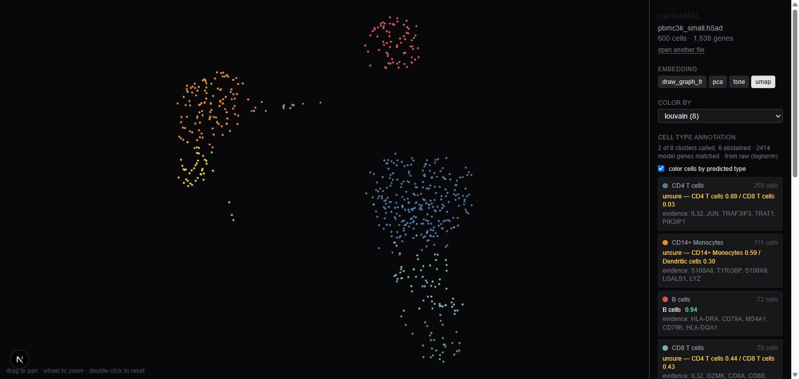

# cellulaML

Drop an `.h5ad` file, see your single-cell analysis instantly, and get every cluster labeled with a **calibrated probability, evidence genes, and an honest "unsure"** — all in the browser. No server, no upload, no questions asked.

**Live demo:** _add your Vercel URL here_



## What it does

1. **Viewer** — reads the embeddings and labels already stored in your file (UMAP / t-SNE / PCA, Louvain / Leiden / any categorical column). WebGL scatter, pan/zoom, color by label or by gene expression, lasso selection with a Wilcoxon rank-sum marker test (BH-corrected).
2. **Annotator** — for each stored cluster, a reference model returns the cell type, a calibrated probability, the genes that drove the call, and abstains when it is not sure.

Everything runs client-side: HDF5 parsing via [h5wasm](https://github.com/usnistgov/h5wasm) in a web worker, rendering in WebGL, statistics and model inference in the worker. Your data never leaves the tab.

## Why another tool

[kana](https://github.com/kanaverse/kana), [cellxgene](https://github.com/chanzuckerberg/cellxgene) and [Vitessce](http://vitessce.io/) already let you look at processed single-cell data, and kana even runs the whole pipeline in the browser. cellulaML is narrower and different in three ways:

- **Zero decisions.** No assay / normalization / feature-type prompts. Drop the file, it opens.
- **Does not die.** Standard scanpy output crashed the gene search of a well-known browser tool during our audit (a non-string gene name and no error boundary). Every value is coerced defensively, every feature has its own error boundary, and 13 malformed-file fixtures run in CI (`npm test`).
- **Calibrated annotation with abstention.** The model reports probabilities that mean what they say (validated on unseen donors), names its evidence, and says "unsure" instead of guessing.

## The reference model

`public/models/pbmc_v2.json` (0.19 MB) — an L1-regularized multinomial logistic regression trained on 12,315 control PBMCs from 8 donors ([Kang et al. 2018](https://doi.org/10.1038/nbt.4042), GSE96583), 8 cell types.

Preprocessing mirrors what the browser does at inference: `log1p(CP10k)` → 3,000 highly variable genes (chosen on training folds only) → divide by per-gene std, clip at 10 → `softmax((W z + b) / T)`.

| Validation (leave-one-donor-out, 8 folds) | |
|---|---|
| Cell-level accuracy | **0.963** (per-donor 0.926–0.978) |
| Balanced accuracy | 0.919 |
| Expected calibration error after temperature scaling (T fit on out-of-fold logits) | **0.0046** |
| Abstention threshold τ = 0.59 | 97% accuracy at 98% coverage (τ = 0.74 → 98% / 96%, τ = 0.90 → 99% / 90%) |
| Cluster-level (77 donor × cluster groups) | 77 / 77 |

**External test** on pbmc3k (10x Genomics, different lab, platform and year; stored Louvain labels hidden): 6 of 8 clusters called, all correct; the model abstained on the 2 it would have gotten wrong (CD8 T vs CD4 T, and Megakaryocytes, whose reference label is red-blood-cell contaminated). Cell-level accuracy 0.87.

Known limits: 8 PBMC types only (no T-cell subtypes, pDC, plasma cells); other tissues and platforms are untested. The model is frozen — it never learns from your data.

Reproduce: `ml/train_reference.py` (Python, `anndata` + `scikit-learn`; `CTRL_ONLY=1` for the shipped model). Scoring against a labeled file: `node scripts/annotate-check.mjs file.h5ad louvain`.

## Run locally

```bash
npm install
npm run dev        # http://localhost:3000
npm test           # parser / stats / geometry fixtures
npm run build
```

Python side (optional, only to retrain):

```bash
cd ml && python -m venv .venv && .venv/Scripts/pip install numpy scipy scikit-learn h5py anndata matplotlib pandas
curl -L -o data/kang_2018.h5ad https://api.figshare.com/v2/file/download/34464122
CTRL_ONLY=1 .venv/Scripts/python train_reference.py
```

## Layout

```
src/lib/h5ad/       AnnData parser (modern and legacy layouts, .raw), gene column access
src/lib/viewer/     WebGL renderer, palettes, lasso geometry
src/lib/stats/      Wilcoxon rank-sum + Benjamini-Hochberg, marker table
src/lib/annotate/   model inference (input-kind detection, gene matching, cluster evidence)
src/workers/        the parser/stats/inference worker (the matrix never leaves it)
src/components/     React UI
ml/                 training pipeline, reports, exported models
tests/              node:test fixtures built with h5wasm
```

## Acknowledgements

h5wasm (NIST) for HDF5 in WebAssembly; scanpy and the pbmc3k tutorial for the demo file; Kang et al. 2018 for the reference data. Method choices (log-CP10k, std scaling with clipping, L1 logistic) follow the general recipe popularized by CellTypist.

## License

MIT
